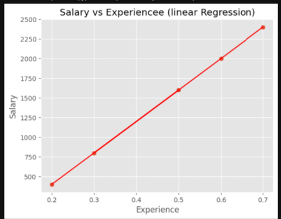

# 📊 Salary Prediction using Linear Regression (One Variable)

A simple Machine Learning project that predicts salary based on years of experience using **Linear Regression from scratch** in Python.

## 🚀 Project Overview

This project demonstrates how a machine learning model learns the relationship between:

> 📈 Years of Experience → 💰 Salary

The model is built using:
- NumPy (for computation)
- Matplotlib (for visualization)
- Gradient Descent (for optimization)

## 🧠 What I Learned

- How linear regression works
- Understanding the equation:
  
  y = wx + b

- Cost function (error measurement)
- Gradient descent optimization
- Importance of feature scaling
- Visualizing predictions vs real data

## 📊 Dataset

| Experience (Years) | Salary |
|-------------------|--------|
| 2 | 400 |
| 3 | 800 |
| 5 | 1600 |
| 6 | 2000 |
| 7 | 2400 |

## ⚙️ Model Workflow

1. Load dataset
2. Normalize features
3. Initialize parameters (w, b)
4. Compute predictions
5. Calculate cost
6. Apply gradient descent
7. Optimize parameters

## 📉 Model Visualization

### Training Result

  

## 🧪 Final Prediction

After training, the model predicts salaries close to actual values.

Example:
- Input: 5 years experience  
- Output: ~1600 salary (approx.)

## 🛠️ Technologies Used

- Python 🐍  
- NumPy 🔢  
- Matplotlib 📊  
 
